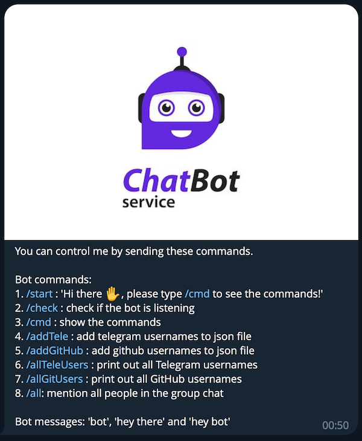

<h1 align="center">Telegram Bot API</h1>

## Contents
- [Brief Description](#brief-description)
- [Languages and Tools](#languages-and-tools-in-this-project)
- [Project Details](#project-details)
- [Installation Guide](#installation-guide)
  1. [GitHub](#1-github)
  2. [Docker](#2-docker)
---
## Brief Description
- This is a telegram bot project with several commands. 
- Project link (GitHub): [tele-bot-api](https://github.com/phamgiaphuc/CurriculumVitaeBuilder)
- Project's author: Pham Gia Phuc - Acus
- Personal profile: [MyProfile](https://github.com/phamgiaphuc)

## Languages and Tools in this project
1. [JavaScript](https://en.wikipedia.org/wiki/JavaScript): Programming language
1. [NodeJS](https://nodejs.org/en): JavaScript runtime environment
2. [ExpressJS](https://expressjs.com/): Web framework
3. [TelegrafJS](https://www.npmjs.com/package/telegraf): Modern Telegram Bot API framework for Node.js
4. [Docker](https://www.docker.com/): To dockerize and run on Docker platform
5. [MongoDB](mongodb.com): Server database
6. [Postman](https://www.postman.com/product/what-is-postman/): Testing tool

<p>
  <a href="https://skillicons.dev">
    
  </a>
</p>

## Project Details
This project is about Telegram Bot that can be served as an admin bot in a Telegram group chat with serveral commands:

**Bot commands:**
1. [/start]() : 'Hi there ✋, please type /cmd to see the commands!'
2. [/check]() : check if the bot is listening
3. [/cmd]() : show the commands
4. [/add]() : add telegram usernames to database
5. [/addgithub]() : add github usernames to database
6. [/allUsers]() : print out all Telegram usernames
7. [/allGitUsers]() : print out all GitHub usernames
8. [/all](): mention all people in the group chat

**Bot messages:** 'bot', 'hey there' and 'hey bot'`

<p align="center">
  

## Installation Guide
### 1. GitHub:
#### Step 1: Git clone this repository to your local computer
```
git clone git@github.com:phamgiaphuc/tele-bot-api.git
```
#### Step 2: Before executing the project, runs this command to install the following `node_modules` and dependencies in the project
```
npm install
```
#### Step 2: Create the Telegram Bot Token and MongoDB url
- Click this website and follow the instruction on `Register a Bot account` section
> [Create and Host a Telegram Bot with Node.js on Code Capsules](https://codecapsules.io/docs/tutorials/create-nodejs-telegram-bot/#polling-vs-webhooks)
- Click this website and follow the instruction on `Get your cluster’s connection info` section in Connect to a MongoDB Database Using Node.js
> [Connect to a MongoDB Database Using Node.js](https://www.mongodb.com/blog/post/quick-start-nodejs-mongodb-how-to-get-connected-to-your-database)
#### Step 3: Create `.env file` and add the environmnet variables
```js
PORT=               // The port -> The default port is 3000
BOT_TOKEN=          // The bot token after you create the Telegram bot
BOT_NAME=           // Your bot name
BOT_USERNAME=       // Your bot username
MY_CHAT_ID=[]       // The chat id
MY_USERNAME=        // Your Telegram username
MONGODB_USERNAME=   // MongoDB username
MONGODB_PASSWORD=   // MongoDB password
MONGODB_URL=        // MongoDB url connection
```
#### Step 4: Apply this command to run the project 
```
npm start
```

### 2. Docker
#### Step 1: Docker pull this image to your local computer
```
docker pull giaphuc/tele-bot-api:1.0.0
```
#### Step 2: Create the Telegram Bot Token and MongoDB url
- Click this website and follow the instruction on `Register a Bot account` section
> [Create and Host a Telegram Bot with Node.js on Code Capsules](https://codecapsules.io/docs/tutorials/create-nodejs-telegram-bot/#polling-vs-webhooks)
- Click this website and follow the instruction on `Get your cluster’s connection info` section in Connect to a MongoDB Database Using Node.js
> [Connect to a MongoDB Database Using Node.js](https://www.mongodb.com/blog/post/quick-start-nodejs-mongodb-how-to-get-connected-to-your-database)
#### Step 3: Add environment variables and docker run this image
```
docker run -it -e PORT='port' \
-e BOT_TOKEN='token' \
-e BOT_NAME='name' \
-e BOT_USERNAME='username' \
-e MY_CHAT_ID='[id]' \
-e MY_USERNAME='telegram username' \
-e MONGODB_USERNAME='mongodb username' \
-e MONGODB_PASSWORD='mongodb password' \
-e MONGODB_URL='mongodb url' \
--name 'TelegramBot' giaphuc/tele-bot-api:1.0.0
```
