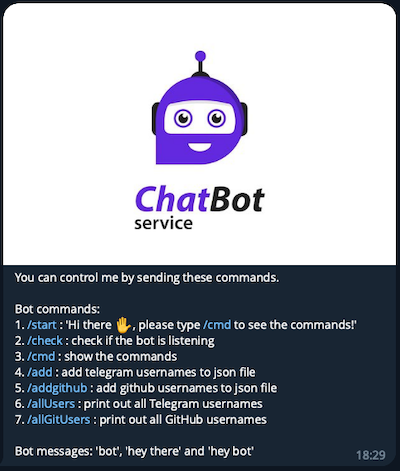

<h1 align="center">Telegram Bot API</h1>

## Contents
- [Brief Description](#brief-description)
- [Languages and Tools](#languages-and-tools-in-this-project)
- [Project Details](#project-details)
- [Installation Guide](#installation-guide)

---
## Brief Description
- This is a telegram bot project with several commands. 
- Project link (GitHub): [tele-bot-api](https://github.com/phamgiaphuc/CurriculumVitaeBuilder)
- Project's author: Pham Gia Phuc - Acus
- Personal profile: [MyProfile](https://github.com/phamgiaphuc)

## Languages and Tools in this project:
1. [NodeJS](https://nodejs.org/en): JavaScript runtime environment
2. [Telegraf](https://www.npmjs.com/package/telegraf): Modern Telegram Bot API framework for Node.js
3. [Docker](https://www.docker.com/): To dockerize and run on Docker platform

<p>
  <a href="https://skillicons.dev">
    
  </a>
</p>

## Project Details
This project is about Telegram Bot that can be served as an admin bot in a Telegram group chat with serveral commands:

**Bot commands:**
1. [/start]() : 'Hi there ✋, please type /cmd to see the commands!'
2. [/check]() : check if the bot is listening
3. [/cmd]() : show the commands
4. [/add]() : add telegram usernames to json file
5. [/addgithub]() : add github usernames to json file
6. [/allUsers]() : print out all Telegram usernames
7. [/allGitUsers]() : print out all GitHub usernames

**Bot messages:** 'bot', 'hey there' and 'hey bot'`

<p align="center">
  

## Installation Guide
#### Step 1: Before executing the project, runs this command to install the following `node_modules` and dependencies in the project
```
npm install
```
#### Step 2: Create the Telegram Bot Token
- Click this website and follow the instruction on `Register a Bot account` section
> [Create and Host a Telegram Bot with Node.js on Code Capsules
](https://codecapsules.io/docs/tutorials/create-nodejs-telegram-bot/#polling-vs-webhooks)
#### Step 3: Create `.env file` and add the environmnet variables
```js
PORT=               // The port -> The default port is 3000
BOT_TOKEN=          // The bot token after you create the Telegram bot
BOT_NAME=           // Your bot name
BOT_USERNAME=       // Your bot username
MY_CHAT_ID=         // The chat id
MY_USERNAME=        // Your Telegram username
MONGODB_USERNAME=   // Mongodb username
MONGODB_PASSWORD=   // Mongodb password
MONGODB_URL=        // Mongodb url connection
```
#### Step 4: Apply this command to run the project 
```
npm start
```

